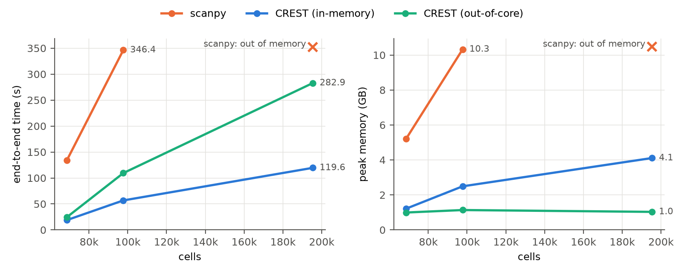
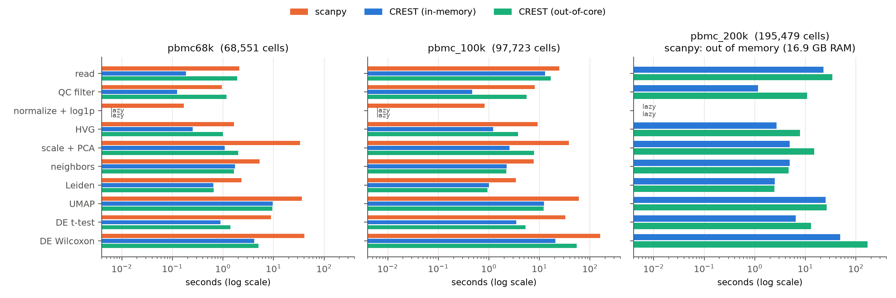

# CREST — Columnar Rust Engine for Single-cell Transcriptomics

CREST runs the standard single-cell RNA-seq workflow (QC → normalisation →
highly variable genes → scaling + PCA → neighbours → Leiden → UMAP →
differential expression) with native Rust kernels behind a scanpy-style Python
API. It reproduces scanpy's results while being faster at every step and never
materialising a normalised, scaled or dense copy of the count matrix — datasets
can be streamed from disk (Parquet) with memory bounded by one chunk.

```python
import crest

bf = crest.read_10x_h5("filtered_feature_bc_matrix.h5")           # or backed="dir/" for out-of-core
bf = crest.pp.filter_cells(bf, min_genes=200)
bf = crest.pp.filter_genes(bf, min_cells=3)
crest.pp.normalize_total(bf, target_sum=1e4)                       # lazy
crest.pp.log1p(bf)                                                 # lazy
crest.pp.highly_variable_genes(bf, n_top_genes=2000, flavor="seurat")
crest.pp.scale(bf, max_value=10)                                   # applied exactly inside PCA
crest.tl.pca(bf, n_comps=50)
crest.pp.neighbors(bf, n_neighbors=15)
crest.tl.leiden(bf, resolution=1.0)
crest.tl.umap(bf)
markers = crest.tl.rank_genes_groups(bf, "leiden", method="wilcoxon")   # Polars DataFrame
de = crest.tl.pseudobulk_de(bf, ["donor", "condition"], "~ donor + condition",   # DESeq2 per cell type
                            contrast=("condition", "stim", "ctrl"), groupby="cell_type")
adata = bf.to_anndata()                                            # hand over to scanpy / scverse
```

Downstream tools ([docs/downstream.md](docs/downstream.md)): Harmony batch
integration (`crest.tl.harmony`), Scrublet doublet detection
(`crest.pp.scrublet`), `seurat_v3` HVGs, a parallel Leiden resolution sweep
with stability scores (`crest.tl.leiden_sweep`), reference mapping / label
transfer (`crest.tl.ingest`) and the DESeq2 likelihood-ratio test
(`DESeq2(test="LRT", reduced=...)`).

## Installation

```bash
pip install crest-sc            # import name: crest
pip install "crest-sc[anndata]" # AnnData / scipy interop
```

Building from source needs a Rust toolchain and [maturin](https://www.maturin.rs):
`maturin develop --release`.

## What is validated against scanpy

Every step is checked against scanpy 1.11 (`tests/test_crest.py`, and
`bench/whitepaper/`). On PBMC3k with the scanpy tutorial parameters:

| step | agreement with scanpy |
|---|---|
| `filter_cells`, `filter_genes`, QC metrics | identical |
| `highly_variable_genes` (seurat) | identical gene set; `dispersions_norm` within 2e-6 |
| `scale` + `pca` | identical subspace (0.000° principal angles), variance ratio within 5e-9 |
| `neighbors` connectivities | identical given the same kNN (within 1e-5) |
| `leiden` | same number of clusters, equal or higher modularity |
| `umap` | equal kNN preservation / silhouette (stochastic layout) |
| `rank_genes_groups` t-test, Wilcoxon | scores within 1e-4 (1e-7 on identical input), same p-values and log fold-changes |
| `score_genes` | identical, including scanpy's control-gene sampling (within 3e-7) |
| `DESeq2` (pseudobulk) | R DESeq2 1.42: size factors, dispersions, log2FC, p-values within ~1e-9 on simulated designs; identical calls on 5 of 8 Kang 2018 cell types, >99% on the rest ([docs/deseq2.md](docs/deseq2.md)); LRT statistics within 1e-6 |
| `highly_variable_genes(flavor="seurat_v3")` | identical gene sets and ranks, `variances_norm` within 1e-14 (loess port matches `skmisc` to 1e-14) |
| `harmony` | same integration quality as harmonypy 2.0 (iLISI 1.81 vs 1.81, cLISI 1.01, ARI 0.82) at 3.5× the speed; neighbourhoods as close to harmonypy's as two harmonypy seeds are to each other |
| `scrublet` | AUROC 0.863 vs 0.863 on Kang 2018 demuxlet doublets, 12× faster |
| `ingest` | 90.7% vs 89.8% label accuracy mapping stimulated onto control PBMCs, 15× faster |

## Performance

Standard scanpy tutorial pipeline, each tool in its own process on the same
4-core / 16.9 GB machine (scanpy 1.11 with igraph Leiden, numba JIT warmed up
beforehand; CREST in-memory and streamed from Parquet). Full tables:
[`bench/whitepaper/results/report.md`](bench/whitepaper/results/report.md).

| dataset | scanpy | CREST in-memory | CREST out-of-core |
|---|---|---|---|
| 68k PBMC (real, 10x) | 134 s · 5.2 GB | **19 s · 1.2 GB** (7.1× faster) | 24 s · **1.0 GB** |
| 100k PBMC v3 | 346 s · 10.3 GB | **57 s · 2.5 GB** (6.1× faster) | 109 s · **1.1 GB** |
| 200k PBMC v3 | *out of memory* | **120 s · 4.1 GB** | 283 s · **1.0 GB** |

Per step at 100k cells (speed-up of CREST in-memory over scanpy): QC 17×,
HVG 7.6×, scale + PCA 15×, neighbours 3.4×, Leiden 3.5×, UMAP 4.9×,
t-test 9.3×, Wilcoxon 7.8×, reading the 10x .h5 1.9× (gzip-bound). Out-of-core
memory stays ~1 GB regardless of dataset size. Leiden clusterings agree with
scanpy (ARI 0.87–0.89, same number of clusters).




The 100k/200k datasets are generated from the real 10k PBMC v3 matrix by
`make_dataset.py` (each cell mixes a real cell with a nearest neighbour after
binomial thinning), so sparsity, library size and cluster structure are realistic.

The figures above come from the 0.2.0 run (`bench/whitepaper/results/`). The
paper benchmark (six real datasets plus a synthetic scaling series, 5 repeats,
thread scaling, per-core CPU/clock/memory timelines, accuracy against scanpy,
bootstrap confidence intervals) runs on your own machine with one command:

```bash
curl -LO https://raw.githubusercontent.com/harshameghadri/CREST/dev/scripts/crest_paper_bench.sh
bash crest_paper_bench.sh --tier standard      # quick | standard | full
```

It clones and builds CREST in a throwaway uv environment, runs the test suites,
records the machine, downloads and checksums the data, runs every
configuration in its own process, and writes `report.md`, CSV/LaTeX tables,
PDF/PNG figures and a `.tar.gz`. The pieces live in `bench/paper/`
(`datasets.py`, `run_one.py`, `monitor.py`, `run_all.py`, `accuracy.py`,
`summarize.py`); module benchmarks in `bench/deseq2/`, `bench/harmony/`,
`bench/doublets/` and `bench/ingest/`.

## How it works

* **Lazy, fused, streamed.** Raw counts stay in one compact store — CSR in
  memory, a Polars triplet frame, or a directory of Parquet parts read one at a
  time. Cell/gene filters and `normalize_total`/`log1p` are recorded and applied
  per cell inside each kernel, so every step is a single pass with no
  intermediate copies.
* **Exact PCA without densifying.** One pass accumulates the gene × gene Gram
  matrix from sparse rows (threads own disjoint row blocks), an eigen-solver
  gives the loadings, a second pass projects cells. `sc.pp.scale(max_value)` is
  applied exactly: zero entries map to a per-gene constant, so the scaled matrix
  is a sparse matrix plus a rank-one term that centring removes.
* **kNN.** Exact search with tiled GEMM (the FAISS "flat" trick) for small data;
  above 20k cells an inverted-file index — cells bucketed by k-means, each bucket
  searched against its 20 nearest buckets, like cell lists in molecular dynamics —
  polished by NN-descent. ≥99.5% recall.
* **UMAP.** umap-learn's objective and defaults, optimised in parallel by domain
  decomposition: each thread owns a range of cells, writes only those, and reads
  the rest from a snapshot refreshed 16× per epoch.
* **Leiden.** Traag et al. (2019): fast local moving, refinement, aggregation.
* **DESeq2 in Rust.** A step-by-step port of DESeq2's `DESeq()` / `results()`, one
  parallel pass over genes per stage, with the NB likelihood evaluated without
  the cancellation R suffers at tiny dispersions. Pseudobulk DE for 8 cell types
  of Kang 2018 takes 7 s (R: 131 s, pydeseq2: 202 s).
* **Sparse Wilcoxon.** All implicit zeros of a gene form one tie block with a
  closed-form rank, so only non-zero values are sorted.
* **Harmony in Rust.** The harmony2 algorithm with cells sorted by batch, so the
  per-batch sums and the ridge correction are GEMMs; per-cell updates in parallel.

Details: [docs/memory_model.md](docs/memory_model.md).

## Data formats

`read_10x_h5` (Cell Ranger v2/v3; `backed=` streams to Parquet), `read_10x_mtx`,
`read_h5ad` (no anndata needed), `BioFrame.from_scipy / from_triplets /
from_anndata`, `write_parquet` / `read_parquet`, `to_anndata`, `to_scipy`.

## Scope and limitations

* HVG flavours: `seurat`, `cell_ranger`, `seurat_v3` / `seurat_v3_paper` (not `pearson_residuals`).
* Batch integration: Harmony only (no scVI/BBKNN).
* DESeq2: Wald and LRT (no `lfcShrink`, `lfcThreshold`), additive formulas
  (pass `design_matrix=` for interactions); see [docs/deseq2.md](docs/deseq2.md).
* `ingest` places query cells in the reference UMAP by umap-learn's transform
  initialisation (no further optimisation).
* UMAP layouts are deterministic for a fixed thread count, not across thread counts.

## License

MIT
